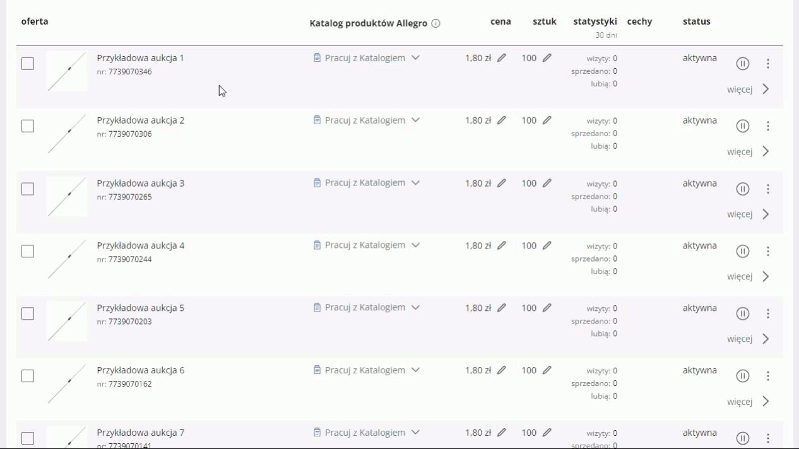
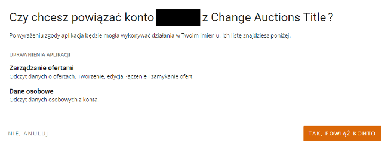
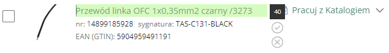
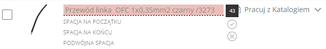
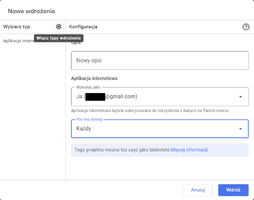
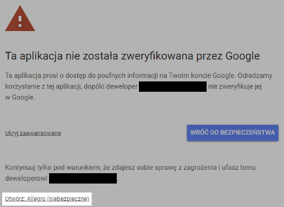
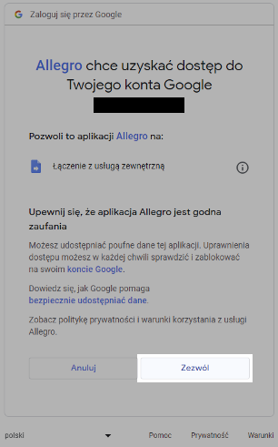
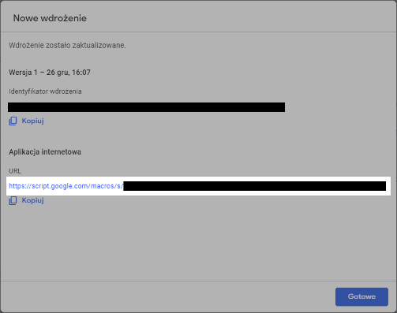
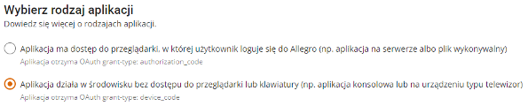
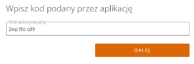

## Szybka zmiana tytułu aukcji
To rozszerzenie pozwala na łatwą i szybką zmianę tytułu aukcji bezpośrednio na liście ofert bez konieczności przechodzenia przez cały proces edycji oferty. Dodatkowo poszerza trochę szerokość kolumny z tytułem aukcji aby wyświetlany tytuł nie był skracany w środku jak ma to miejsce w przypadku gdy jest on długi.

Jest to rozszerzenie do przeglądarki Chrome. Wszystkie rozszerzenia testuję tylko dla systemu Windows 10 i najnowszej wersji przeglądarki.

**Instrukcja instalacji:**
1. Pobierz rozszerzenie "change_auctions_title.zip" z listy plików widocznej powyżej i rozpakuj je tam gdzie zamierzasz je trzymać.
2. Kliknij ikonę menu rozszerzeń w prawym górnym rogu okna przeglądarki (ikona puzzla)  lub z menu przeglądarki wybierz "Rozszerzenia - Zarządzaj rozszerzeniami".
3. Włącz "Tryb dewelopera" w prawym górnym rogu okna przeglądarki 
4. Kliknij przycisk "Załaduj rozpakowane"  

5. Wybierz folder z uprzednio pobranym i rozpakowanym rozszerzeniem.
6. Po załadowaniu rozszerzenia otworzy się strona jego opcji, gdzie wymagane będzie uzupełnienie danych Client ID i Client Secret. Uzyskasz je rejestrując aplikację na stronie [apps.developer.allegro.pl](https://apps.developer.allegro.pl/)
	

	
Instrukcja rejestracji aplikacji

	
	1. Otwórz stronę [developer.allegro.pl](https://developer.allegro.pl/).
	2. Kliknij "Zarządzaj API" - "Moje aplikacje". Upewnij się że zalogowany jesteś na konto Allegro w ramach którego działać będzie aplikacja. Jeśli nie, wyloguj się (klikając ikonę obok nazwy użytkownika i wybierz "Wyloguj") a następnie zaloguj się na właściwe konto.
	3. Kliknij przycisk "Zarejestruj aplikację".  
	4. W formularzu rejestracji aplikacji Allegro podaj następujące dane:
		- **Nazwa aplikacji:** dowolna, np. "Change Auctions Title"
		- **Wybierz rodzaj aplikacji:** zaznacz pierwszą opcję ("Aplikacja ma dostęp do przeglądarki, w której użytkownik loguje się do Allegro (np. aplikacja na serwerze albo plik wykonywalny)")  
		
		- **Ścieżka aplikacji:** na stronie opcji rozszerzenia zaznacz i skopiuj tekst widniejący przy parametrze **Ścieżka aplikacji**. Jest to unikalny adres aplikacji w domenie chromiumapp.org pod który Allegro będzie przesyłać kod autoryzujący i tokeny dostępowe.
		- **Uprawnienia aplikacji:** zaznacz następujące uprawnienia: `allegro:api:sale:offers:read` `allegro:api:sale:offers:write` (sekcja **Zarządzanie ofertami**), `allegro:api:profile:read` (sekcja **Dane osobowe**).
		- Zaznacz `* Znam i akceptuję regulamin REST API Allegro`.
		- Kliknij przycisk "Zarejestruj".
		- Na koncie możesz mieć do 5 zarejestrowanych aplikacji. Jeżeli chciałbyś ją usunąć zrobisz to na tej samej stronie.
	5. Aplikacja zostanie zarejestrowana. Kliknij "Szczegóły" aby odczytać Client ID i Client Secret. Zaznacz i skopiuj parametr Client ID, wklej go na stronie opcji rozszerzenia w polu Client ID. Kliknij "Pokaż" przy parametrze Client Secret, aby odsłonić domyślnie zamaskowaną wartość tego parametru, zaznacz i skopiuj parametr Client Secret, wklej go na stronie opcji rozszerzenia w polu Client Secret. Zamknij okno ze szczegółami aplikacji.
	6. Kliknij "Zapisz" a następnie "Zaloguj" na stronie opcji rozszerzenia. Zostaniesz przeniesiony na stronę Allegro gdzie musisz potwierdzić że kontynuujesz jako zalogowany użytkownik  
	
	7. Kliknij przycisk "Kontynuuj".
	8. Zostaniesz przeniesiony na stronę Allegro z pytaniem czy chcesz powiązać swoje konto z aplikacją  
	
	9. Kliknij przycisk "Tak, powiąż konto". Jeśli chiałbyś usunąć powiązanie aplikacji z kontem zrobisz to na stronie Allegro - Moje Allegro - Konto - Bezpieczeństwo - [Powiązane aplikacje](https://allegro.pl/moje-allegro/moje-konto/powiazane-aplikacje)
	10. Na stronie opcji rozszerzenia pojawi się komunikat o zalogowaniu wraz z nazwą użytkownika.  
	

7. Jeżeli miałeś otwartą stronę "Mój asortyment", odśwież ją, celem załadowania rozszerzenia.
8. Najedź kursorem myszy na tytuł aukcji który chcesz zmienić i wciśnij <kbd>Ctrl</kbd> + <kbd>Insert</kbd> (jest to domyślny skrót, możesz go zmienić na stronie opcji rozszerzenia). Tytuł aukcji podświetli się na zielono i będzie możliwa jego edycja. Obok tytułu pojawi się licznik znaków pokazujący długość tekstu (tytuł może mieć do 75 znaków) oraz przyciski do zatwierdzenia i odrzucenia wprowadzonej zmiany. Alternatywnie zatwierdzić można klawiszem <kbd>Enter</kbd> a odrzucić klawiszem <kbd>Esc</kbd> lub klikając w dowolnym miejscu poza polem edycji  
	  
	Rozszerzenie stara się walidować na bieżąco poprawność wprowadzanych zmian jeszcze przed ich zatwierdzeniem, dotyczy to m.in.:
	- tytuł nie może zawierać spacji na początku ani na końcu
	- w tytule nie mogą wystąpić dwie lub więcej spacje pod rząd
	- w tytule nie mogą występować nowe linie
	- w tytule nie mogą występować znaki emoji ani unicode spoza pewnego zakresu (w dużym uproszczeniu znaki inne niż występujące w językach polskim i serwisów zagranicznych Allegro oraz znaki możliwe do wprowadzenia na klawiaturze i niektóre znaki typu €, §, °, ± itp.); w przypadku próby wprowadzenia niedopuszczonych znaków nie zostaną one wprowadzone.

	Przy zatwierdzaniu jeżeli występują błędy dotyczące spacji i nie zostały one poprawione przez użytkownika - zostaną one automatycznie poprawione. 
	Przy wklejaniu tekstu wszelkie znaki nowej linii zostaną zamienione na spacje, wielokrotne spacje zostaną zamienione na pojedyncze a znaki spoza dopuszczalnego zakresu zostaną wycięte, pojawi się też stosowny komunikat o dokonanej zmianie.

	W przypadku gdy tytuł nie będzie spełniał wymogów walidacji będzie on podświetlony na czerwono wraz z informacjami co jest nieprawidłowe  
	

Rozszerzenie możesz sprawdzić w serwisie testowym [Allegro Sandbox](https://developer.allegro.pl/tutorials/informacje-podstawowe-b21569boAI1#srodowisko-testowe).  

Instrukcja rejestracji aplikacji dla serwisu testowego

Uzyskanie danych dostępowych dla serwisu testowego jest trochę bardziej skomplikowane niż dla normalnego Allegro. Powodem jest to że rozszerzenie nie może uzyskać tokenów dostępowych w taki sam sposób, choć jakiś czas temu było to jeszcze możliwe więc zmiana zaszła albo po stronie Allegro albo przy którejś wersji Chrome. Kontaktowałem się z obsługą na stronie GitHub Allegro jednak oni nie widzą problemu, poza tym nie wspierają konkretnych języków programowania a ponieważ raczej nikt nie pisze rozszerzeń do przeglądarki Chrome działających z Allegro tylko tworzy się serwisy lub zewnętrzne aplikacje działające w inny sposób i tam ten problem nie występuje to nie będą drążyć tematu.

Trzeba było więc sobie jakoś z tym poradzić więc stworzyłem zewnętrzną aplikację pośredniczącą w uzyskiwaniu tokenów dostępowych do serwisu Allegro Sandbox. Zdaję sobie sprawę że nie każdy posiada serwer z obsługą Node.js dlatego działa ona jako aplikacja w ramach konta Google które większość osób i tak posiada albo może bez problemu założyć.

1. Przejdź na stronę [script.google.com](https://script.google.com/).
2. Kliknij "Ustawienia" - "Google Apps Script API" - włącz.
3. Kliknij "Nowy projekt". Otworzy się edytor domyślnego pliku "Kog.gs". Zmień nazwę projektu z "Projekt bez nazwy" na np. "Allegro".
4. Otwórz plik "Kod.js" z listy plików na górze tej strony i skopiuj jego zawartość.
5. Usuń z edytora obecną zawartość pliku i wklej skopiowany tekst. Zapisz wciskając <kbd>Ctrl</kbd> + <kbd>s</kbd>.
6. Kliknij "Wdróż" - "Nowe wdrożenie".
7. Kliknij ikonę kółka zębatego i wybierz "Aplikacja internetowa". Pole "Opis" nie jest wymagane, parametr "Wykonaj jako": "Ja (adres konta Google)", "Kto ma dostęp" zmień na "Każdy". Kliknij "Wdróż"  
	
8. Pojawi się komunikat o konieczności udzielenia dostępu do aplikacji internetowej. Kliknij przycisk "Udziel dostępu", wybierz konto Google, pojawi się kolejny komunikat informujący o tym że aplikacja nie jest zweryfikowana. Kliknij "Zaawansowane", następnie "Otwórz Allegro (niebezpieczne)" (gdzie "Allegro" to nazwa aplikacji nadana wcześniej w edytorze)  
	
9. W kolejnym komunikacie pojawi się informacja że aplikacja chce uzyskać dostęp do konta Google w zakresie łączenia się z usługą zewnętrzną. Kliknij "Zezwól"  
	
10. Prawdopodobnie pojawi się strona z błędem "400 Bad request", jednak mimo tego dostęp aplikacji do konta zostanie przydzielony. Jeśli chciałbyś usunąć udzielony dostęp do konta Google zrobisz to w ustawieniach konta, sekcja "Bezpieczeństwo" - "Twoje połączenia z aplikacjami i usługami innych firm".
11. Na stronie wdrożenia pojawi się komunikat ze szczegółami wdrożenia, z których istotnym parametrem jest link - aplikacja internetowa. Skopiuj go i wklej na stronie opcji rozszerzenia do pola "Adres aplikacji internetowej" 
    
12. Przejdź na stronę [developer.allegro.pl](https://developer.allegro.pl/).
13. Kliknij "Zarządzaj API" - "Moje aplikacje (sandbox)". Upewnij się że zalogowany jesteś na konto Allegro (sandbox) w ramach którego działać będzie aplikacja. Jeśli nie, wyloguj się (klikając ikonę obok nazwy użytkownika i wybierz "Wyloguj") a następnie zaloguj się na właściwe konto.
14. Kliknij przycisk "Zarejestruj aplikację".
15. W formularzu rejestracji aplikacji Allegro podaj następujące dane:
	- **Nazwa aplikacji:** dowolna, np. "Change Auctions Title"
	- **Wybierz rodzaj aplikacji:** zaznacz drugą opcję ("Aplikacja działa w środowisku bez dostępu do przeglądarki lub klawiatury (np. aplikacja konsolowa lub na urządzeniu typu telewizor)")  
	
	- **Uprawnienia aplikacji:** zaznacz następujące uprawnienia: `allegro:api:sale:offers:read` `allegro:api:sale:offers:write` (sekcja **Zarządzanie ofertami**), `allegro:api:profile:read` (sekcja **Dane osobowe**).
	- Zaznacz `* Znam i akceptuję regulamin REST API Allegro`.
	- Kliknij przycisk "Zarejestruj".
	- Na koncie możesz mieć do 5 zarejestrowanych aplikacji. Jeżeli chciałbyś ją usunąć zrobisz to na tej samej stronie.
16. Aplikacja zostanie zarejestrowana. Kliknij "Szczegóły" aby odczytać Client ID i Client Secret. Zaznacz i skopiuj parametr Client ID, wklej go na stronie opcji rozszerzenia w polu Client ID. Kliknij "Pokaż" przy parametrze Client Secret, aby odsłonić domyślnie zamaskowaną wartość tego parametru, zaznacz i skopiuj parametr Client Secret, wklej go na stronie opcji rozszerzenia w polu Client Secret. Zamknij okno ze szczegółami aplikacji.
17. Kliknij "Zapisz" a następnie "Zaloguj" na stronie opcji rozszerzenia. Zostaniesz przeniesiony na stronę Allegro gdzie musisz wprowadzić kod podany przez aplikację (kod uzupełni się automatycznie)  
	
18. Kliknij przycisk "Dalej". Zostaniesz przeniesiony na stronę Allegro gdzie musisz potwierdzić że kontynuujesz jako zalogowany użytkownik  
	
19. Kliknij przycisk "Kontynuuj". Zostaniesz przeniesiony na stronę Allegro z pytaniem czy chcesz powiązać swoje konto z aplikacją  
	
20. Kliknij przycisk "Tak, powiąż konto". Jeśli chiałbyś usunąć powiązanie aplikacji z kontem zrobisz to na stronie Allegro - Moje Allegro - Konto - Bezpieczeństwo - [Powiązane aplikacje](https://allegro.pl.allegrosandbox.pl/moje-allegro/moje-konto/powiazane-aplikacje)
21. Na stronie opcji rozszerzenia pojawi się komunikat o zalogowaniu wraz z nazwą użytkownika.  

***
Jeżeli napotkasz jakieś błędy w trakcie działania aplikacji, masz jakieś pytania, sugestie, problemy z obsługą, daj znać w sekcji "Discussions".
Jeżeli podoba Ci się moja praca i chcesz aby była dalej rozwijana, możesz wesprzeć mnie dotacją na dowolną kwotę przez PayPal (nie ma potrzeby posiadania konta PayPal): [przekaż donację](https://www.paypal.com/donate/?hosted_button_id=GVU3UC2ZY85SN&locale.x=pl_PL)
